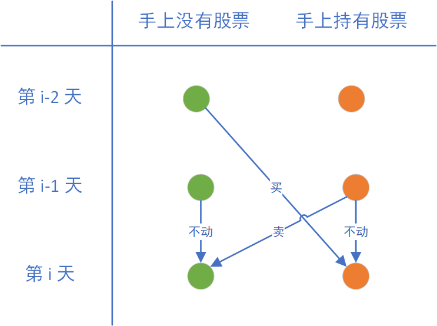

# 学习笔记

## DP写完如何检查是正确的？

股票 DP 方程写完后，最终代码太简单，自己都难以置信这样就能算出答案？可能是因为 DP 思维还没转变过来吧。就拿 [188. 买卖股票的最佳时机 IV](https://leetcode-cn.com/problems/best-time-to-buy-and-sell-stock-iv/) 来说，代码逻辑简单到自己都不相信，总觉得自己是不是少考虑了几种情况。

```python
class Solution:
    def maxProfit(self, K: int, prices: List[int]) -> int:
        N = len(prices)
        dp = [[[0]*(K+1) for _ in range(2)] for _ in range(N+1)]
        # 约定为最多买入 k 次
        for k in range(K+1):
            dp[-1][1][k] = -math.inf
            # dp[-1][0][k] = 0
        
        for i in range(N):
            for k in range(K+1):
                dp[i][0][k] = max(dp[i-1][0][k], dp[i-1][1][k] + prices[i])
                if k > 0:
                    dp[i][1][k] = max(dp[i-1][1][k], dp[i-1][0][k-1] - prices[i])
                else:
                    dp[i][1][k] = -math.inf
        
        return dp[N-1][0][K]
```

## 309. 最佳买卖股票时机含冷冻期

每天都有3种可能的操作：买、卖、不动。

我们将状态树画出，使用暴力递归遍历所有操作。随着树深度增加，节点数量爆发式增长！问题的本质是节点承载的信息量太大了（包含了所有历史交易记录），这些信息是没用的，因此我们归纳有用信息，减少每一层的节点数量。

【方法一】我们将状态树中绿色、黄色的节点归纳到一起，归纳得到一张DP表，这就使得每一层的节点数量仅为2。


对于上面这棵状态树，我们归纳为如下DP表。



```python
class Solution:
    def maxProfit(self, prices: List[int]) -> int:
        if not prices: return 0
        n = len(prices)
        a = [0]*(n+2)  # 没有股票
        b = [0]*(n+2)  # 持有股票
        a[-2] = 0
        a[-1] = 0
        # b[-2] = xxx  # 不管初始化为任何值，都不影响结果
        b[-1] = -prices[0]  # 也可用负无穷大

        for i in range(n):
            a[i] = max(a[i-1], b[i-1] + prices[i])
            b[i] = max(b[i-1], a[i-2] - prices[i])
        
        return a[n-1]
```

【方法二】在方法一中，我们计算 `a[i]` 的时候要用到前两天的信息，这是一种DP艺术。但标准DP只依赖前一天的信息（我乱说的），下面我们重新对状态树进行归纳，将绿色、黄色、蓝色的节点归纳到一起，归纳得到一张标准DP表，这使得每一层节点数量为3。


对于上面这棵状态树，我们归纳为如下DP表。


```python
class Solution:
    def maxProfit(self, prices: List[int]) -> int:
        if not prices: return 0
        n = len(prices)
        a = [0]*(n+1)  # 没有股票
        b = [0]*(n+1)  # 持有股票
        c = [0]*(n+1)  # 冷冻期
        a[-1] = 0
        b[-1] = -prices[0]  # 也可用负无穷大
        c[-1] = 0

        for i in range(n):
            a[i] = max(a[i-1], c[i-1])
            b[i] = max(b[i-1], a[i-1] - prices[i])
            c[i] = b[i-1] + prices[i]
        
        return max(a[n-1], c[n-1])
```

## 每周课内遍数记录

一开始每周都有记录课外刷题，后来不记录了。

因为课内题是按每周知识点划分的，课外题就比较杂乱。

所以就增加了一个「刷题笔记」，刷题笔记包含了课内+课外题目，是按照知识点划分的。

### week1刷题遍数记录
课内实战
| 敲代码 | 阅读别人代码 | 备注       | 题目                                                         |
| ---- | ------------ | ------------------------------------------------------------ | ------------------------------------------------------------ |
| 3 |     | 暴力、双指针  | [11. 盛最多水的容器](https://leetcode-cn.com/problems/container-with-most-water/) |
| 3 |     |               | [70. 爬楼梯](https://leetcode-cn.com/problems/climbing-stairs/) |
| 3 | 1   |               | [15. 三数之和](https://leetcode-cn.com/problems/3sum/)       |
| 3 | 1   |                  | [206. 反转链表](https://leetcode-cn.com/problems/reverse-linked-list/) |
| 3 | 1   | 递归、迭代、多练习   | [24. 两两交换链表中的节点](https://leetcode-cn.com/problems/swap-nodes-in-pairs/) |
| 2 | 1   | 哈希表、快慢指针 | [141. 环形链表](https://leetcode-cn.com/problems/linked-list-cycle/) |
| 1 | \*2 | 哈希表、\*快慢指针 | [\*142. 环形链表 II](https://leetcode-cn.com/problems/linked-list-cycle-ii/) |
| 1 | \*1 |                  | [25. K 个一组翻转链表](https://leetcode-cn.com/problems/reverse-nodes-in-k-group/) |
| 2 | 2   |      | [20. 有效的括号](https://leetcode-cn.com/problems/valid-parentheses/) |
| 3 |     |      | [155. 最小栈](https://leetcode-cn.com/problems/min-stack/)   |
| 2 | \*4 | 多次无法顺利写出 | [\**84. 柱状图中最大的矩形](https://leetcode-cn.com/problems/largest-rectangle-in-histogram/) |
| 2 | 2   |      | [\*239. 滑动窗口最大值](https://leetcode-cn.com/problems/sliding-window-maximum/) |

课后作业
| 敲代码 | 阅读别人代码 | 备注               | 题目                                                         |
| ------ | ------------ | -------------------- | ------------------------------------------------------------ |
| 3 |              | 软柿子 | [26. 删除排序数组中的重复项](https://leetcode-cn.com/problems/remove-duplicates-from-sorted-array/) |
| 1 |              |                      | [189. 旋转数组](https://leetcode-cn.com/problems/rotate-array/) |
| 2 |              |                      | [21. 合并两个有序链表](https://leetcode-cn.com/problems/merge-two-sorted-lists/) |
| 1 | 1            | 就地合并、开额外空间 | [88. 合并两个有序数组](https://leetcode-cn.com/problems/merge-sorted-array/) |
| 1 |              |               | [1. 两数之和](https://leetcode-cn.com/problems/two-sum/)     |
| 2 | 1            | 末尾补0、交换、有变种 | [283. 移动零](https://leetcode-cn.com/problems/move-zeroes/) |
| 1 |              |  | [66. 加一](https://leetcode-cn.com/problems/plus-one/) |
| 1 |              |  | [242. 有效的字母异位词](https://leetcode-cn.com/problems/valid-anagram/) |
|   |              | | [641. 设计循环双端队列](https://leetcode-cn.com/problems/design-circular-deque/) |
| 1 | \*1 | | [49. 字母异位词分组](https://leetcode-cn.com/problems/group-anagrams/) |
| 1 |  | 重点复习 | [\*42. 接雨水](https://leetcode-cn.com/problems/trapping-rain-water/) |

课外刷题

| 敲代码 | 阅读别人代码 | 备注                           | 题目                                                         |
| ------ | ------------ | ------------------------------ | ------------------------------------------------------------ |
| 1      | 1            | DP、DP状压                     | [120. 三角形最小路径和](https://leetcode-cn.com/problems/triangle/) |
| \*0    |              | 构造邻接表、广搜、两边同时广搜 | [\*127. 单词接龙](https://leetcode-cn.com/problems/word-ladder/) |
| 1      |              | split库函数                    | [151. 翻转字符串里的单词](https://leetcode-cn.com/problems/reverse-words-in-a-string/) |

### week2刷题遍数记录
课内实战
| 敲代码 | 阅读别人代码 | 备注    | 题目                                                         |
| ---- | ------------ | ------------------------------------------------------------ | ------------------------------------------------------------ |
| 1 | \*1 | 多复习题解 | [剑指 Offer 40. 最小的k个数](https://leetcode-cn.com/problems/zui-xiao-de-kge-shu-lcof/) |
| 这题重复 | - | - | 239. 滑动窗口最大值 |
| 这题重复 | - | - | 70. 爬楼梯 |
| 1 | 1 | 多复习 | [22. 括号生成](https://leetcode-cn.com/problems/generate-parentheses/) |
| 1 |  | 软柿子 | [226. 翻转二叉树](https://leetcode-cn.com/problems/invert-binary-tree/) |
| 1 |  | 软柿子 | [104. 二叉树的最大深度](https://leetcode-cn.com/problems/maximum-depth-of-binary-tree/) |
| 2 | 3 | 多复习，易丢分，最简代码 | [111. 二叉树的最小深度](https://leetcode-cn.com/problems/minimum-depth-of-binary-tree/) |
| 1 | 1 | 有点意思，国际站有神仙 | [297. 二叉树的序列化与反序列化](https://leetcode-cn.com/problems/serialize-and-deserialize-binary-tree/) |

课后作业
| 敲代码 | 阅读别人代码 | 备注               | 题目                                                         |
| ------ | ------------ | -------------------- | ------------------------------------------------------------ |
| 1 |    |      | [590. N叉树的后序遍历](https://leetcode-cn.com/problems/n-ary-tree-postorder-traversal/) |
| 1 | | | [589. N叉树的前序遍历](https://leetcode-cn.com/problems/n-ary-tree-preorder-traversal/) |
| 1 | | 递归、迭代 | [94. 二叉树的中序遍历](https://leetcode-cn.com/problems/binary-tree-inorder-traversal/) |
| 1 | | 递归、迭代 | [144. 二叉树的前序遍历](https://leetcode-cn.com/problems/binary-tree-preorder-traversal/) |
| 1 | |  | [429. N叉树的层序遍历](https://leetcode-cn.com/problems/n-ary-tree-level-order-traversal/) |
| 1 | 2 | 堆、3指针DP | [\*剑指 Offer 49. 丑数](https://leetcode-cn.com/problems/chou-shu-lcof/)、[\*264. 丑数 II](https://leetcode-cn.com/problems/ugly-number-ii/) |
| 1 | | | [347. 前 K 个高频元素](https://leetcode-cn.com/problems/top-k-frequent-elements/) |
| 2 | 2 | 多复习 | [236. 二叉树的最近公共祖先](https://leetcode-cn.com/problems/lowest-common-ancestor-of-a-binary-tree/) |
| 1 | 1 | | [105. 从前序与中序遍历序列构造二叉树](https://leetcode-cn.com/problems/construct-binary-tree-from-preorder-and-inorder-traversal/) |
| 1 | | | [77. 组合](https://leetcode-cn.com/problems/combinations/) |
| 2 | 1 | | [46. 全排列](https://leetcode-cn.com/problems/permutations/) |
| 1 | | | [47. 全排列 II](https://leetcode-cn.com/problems/permutations-ii/) |

课外刷题

| 敲代码 | 阅读别人代码 | 备注                     | 题目                                                         |
| ------ | ------------ | -------------------------- | ------------------------------------------------------------ |
| 1 |    |      | [1021. 删除最外层的括号](https://leetcode-cn.com/problems/remove-outermost-parentheses/) |
| 1 | | | [103. 二叉树的锯齿形层次遍历](https://leetcode-cn.com/problems/binary-tree-zigzag-level-order-traversal/) |
| 1 | 1 | | [1025. 除数博弈](https://leetcode-cn.com/problems/divisor-game/) |

### week3刷题遍数记录

课内实战
| 敲代码   | 阅读别人代码 | 备注           | 题目                                                         |
| -------- | ------------ | -------------- | ------------------------------------------------------------ |
| 1        |              | 软柿子         | [50. Pow(x, n)](https://leetcode-cn.com/problems/powx-n/)    |
| 1        |              | DFS、数学      | [78. 子集](https://leetcode-cn.com/problems/subsets/)        |
| 1        |              |                | [169. 多数元素](https://leetcode-cn.com/problems/majority-element/) |
| 1        |              | 要复习         | [17. 电话号码的字母组合](https://leetcode-cn.com/problems/letter-combinations-of-a-phone-number/) |
| 2        | 1            | 多练、用时太久 | [51. N皇后](https://leetcode-cn.com/problems/n-queens/)      |
| 2        |              |                | [102. 二叉树的层序遍历](https://leetcode-cn.com/problems/binary-tree-level-order-traversal/) |
| 1        |              |                | [433. 最小基因变化](https://leetcode-cn.com/problems/minimum-genetic-mutation/) |
| 这题重复 |              |                | 22. 括号生成                                                 |
| 1        |              |                | [515. 在每个树行中找最大值](https://leetcode-cn.com/problems/find-largest-value-in-each-tree-row/) |

课后作业

| 敲代码 | 阅读别人代码 | 备注                         | 题目                                                         |
| ------ | ------------ | ---------------------------- | ------------------------------------------------------------ |
| 1      | 1            | 有变种吧？                   | [860. 柠檬水找零](https://leetcode-cn.com/problems/lemonade-change/) |
| 1      |              | 整个系列挺难的               | [122. 买卖股票的最佳时机 II](https://leetcode-cn.com/problems/best-time-to-buy-and-sell-stock-ii/) |
| 1      |              |                              | [455. 分发饼干](https://leetcode-cn.com/problems/assign-cookies/) |
|        |              |                              | [874. 模拟行走机器人](https://leetcode-cn.com/problems/walking-robot-simulation/) |
| 2      | 4            | 重点复习                     | [127. 单词接龙](https://leetcode-cn.com/problems/word-ladder/) |
| 1      |              | 搜索、并查集                 | [200. 岛屿数量](https://leetcode-cn.com/problems/number-of-islands/) |
| 1      |              | 这题不复习了，题目读半天     | [529. 扫雷游戏](https://leetcode-cn.com/problems/minesweeper/) |
| 1      |              |                              | [55. 跳跃游戏](https://leetcode-cn.com/problems/jump-game/)  |
| 2      | 2            | 多复习，二分查找的难题       | [\*33. 搜索旋转排序数组](https://leetcode-cn.com/problems/search-in-rotated-sorted-array/) |
| 1      | 1            | 二分、从右上角开始当做搜索树 | [74. 搜索二维矩阵](https://leetcode-cn.com/problems/search-a-2d-matrix/) |
| 2      | 2            | 二分，多复习                 | [153. 寻找旋转排序数组中的最小值](https://leetcode-cn.com/problems/find-minimum-in-rotated-sorted-array/) |
| 3      | 2            | 重点复习                     | [126. 单词接龙 II](https://leetcode-cn.com/problems/word-ladder-ii/) |
| 1      | 1            | 重点复习                     | [45. 跳跃游戏 II](https://leetcode-cn.com/problems/jump-game-ii/) |

### week4刷题遍数记录

课内实战

| 敲代码   | 阅读别人代码 | 备注             | 题目                                                         |
| -------- | ------------ | ---------------- | ------------------------------------------------------------ |
| 1        |              |                  | [62. 不同路径](https://leetcode-cn.com/problems/unique-paths/) |
| 1        |              |                  | [63. 不同路径 II](https://leetcode-cn.com/problems/unique-paths-ii/) |
| 1        |              | 多复习           | [1143. 最长公共子序列](https://leetcode-cn.com/problems/longest-common-subsequence/) |
| 这题重复 |              |                  | 70. 爬楼梯                                                   |
| 1        |              | 多复习           | [120. 三角形最小路径和](https://leetcode-cn.com/problems/triangle/) |
| 1        | 1            |                  | [53. 最大子序和](https://leetcode-cn.com/problems/maximum-subarray/) |
|          |              | 重点复习，好难啊 | [152. 乘积最大子数组](https://leetcode-cn.com/problems/maximum-product-subarray/) |
| 1        | 1            |                  | [322. 零钱兑换](https://leetcode-cn.com/problems/coin-change/) |
| 1        | 1            |                  | [198. 打家劫舍](https://leetcode-cn.com/problems/house-robber/) |
| 1        | 1            |                  | [213. 打家劫舍 II](https://leetcode-cn.com/problems/house-robber-ii/) |
| 1        |              |                  | [121. 买卖股票的最佳时机](https://leetcode-cn.com/problems/best-time-to-buy-and-sell-stock/) |
| 这题重复 |              |                  | 122. 买卖股票的最佳时机 II                                   |
| 2        | 2            | 重点复习         | [123. 买卖股票的最佳时机 III](https://leetcode-cn.com/problems/best-time-to-buy-and-sell-stock-iii/) |
| 1        |              |                  | [309. 最佳买卖股票时机含冷冻期](https://leetcode-cn.com/problems/best-time-to-buy-and-sell-stock-with-cooldown/) |
| 1        | 1            |                  | [188. 买卖股票的最佳时机 IV](https://leetcode-cn.com/problems/best-time-to-buy-and-sell-stock-iv/) |
| 1        |              |                  | [714. 买卖股票的最佳时机含手续费](https://leetcode-cn.com/problems/best-time-to-buy-and-sell-stock-with-transaction-fee/) |

课后作业

| 敲代码 | 阅读别人代码 | 备注               | 题目                                                         |
| ------ | ------------ | ------------------ | ------------------------------------------------------------ |
| 1      |              |                    | [64. 最小路径和](https://leetcode-cn.com/problems/minimum-path-sum/) |
| 1      |              |                    | [91. 解码方法](https://leetcode-cn.com/problems/decode-ways/) |
| 1      | \*1          |                    | [221. 最大正方形](https://leetcode-cn.com/problems/maximal-square/) |
|        |              | \*这题是不是DP啊？ | [\*621. 任务调度器](https://leetcode-cn.com/problems/task-scheduler/) |
| 1      | 1            |                    | [647. 回文子串](https://leetcode-cn.com/problems/palindromic-substrings/) |

